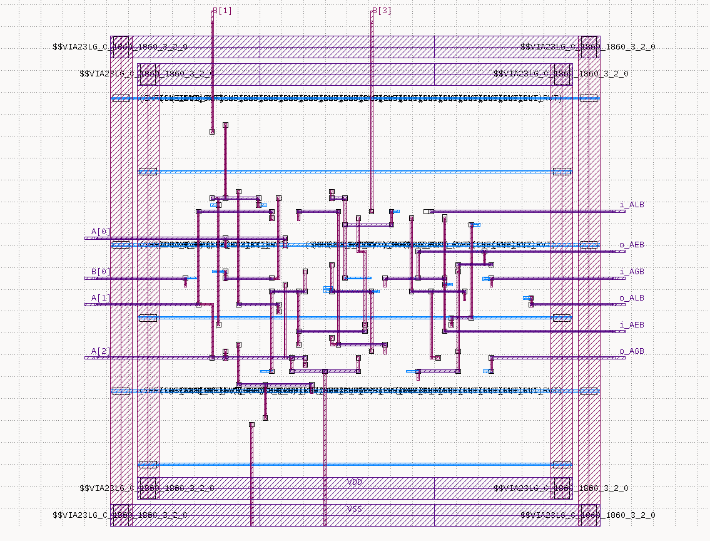
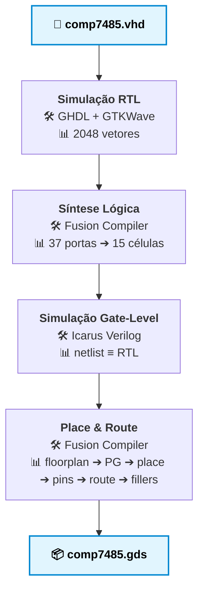
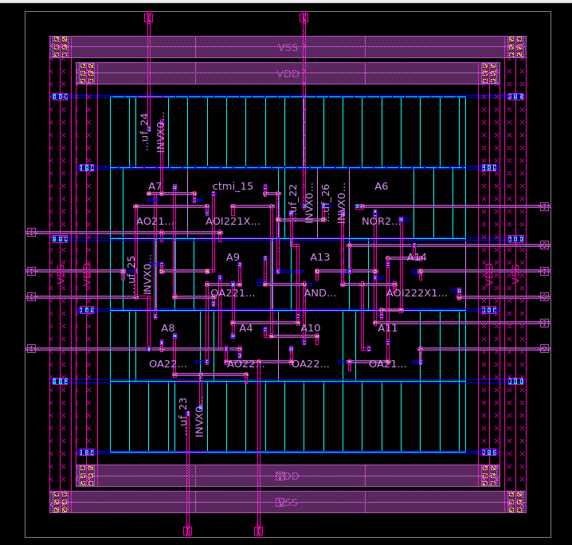

# comp7485 — Implementação completa de um ASIC comparador de de 4 bits

Projeto desenvolvido como introdução e familiarização prática ao fluxo ASIC a partir de um modelo VHDL 
do clássico comparador **7485**, levado do RTL até o GDSII com o **Synopsys Fusion Compiler** e a tecnologia **SAED 32 nm**.



---

## O 7485

O 7485 compara dois números de 4 bits e indica se A é maior, igual ou menor que B. 
Três entradas de cascata permitem encadear vários comparadores para operandos mais largos.

| Porta | Direção | Tamanho | Descrição |
|---|---|---|---|
| `A`, `B` | entrada | 4 bits | operandos a comparar |
| `i_AGB`, `i_AEB`, `i_ALB` | entrada | 1 bit | cascata de estágios anteriores |
| `o_AGB`, `o_AEB`, `o_ALB` | saída | 1 bit | resultado da comparação |

Circuito **puramente combinacional** não possuindo clock nem elementos de memória
A lógica de cascata segue a tabela verdade do datasheet da Texas Instruments.

https://www.ti.com/lit/ds/symlink/sn54ls85.pdf?ts=1790189442372&ref_url=https%253A%252F%252Fwww.google.com%252F

## Resultados

| Métrica | Valor |
|---|---|
| Tecnologia | SAED 32 nm, 9 camadas de metal, células RVT |
| Corner de análise | slow, 0,75 V, 125 °C |
| Células lógicas | 15 (todas combinacionais) |
| Níveis de lógica | 5 |
| Caminho crítico | **0,86 ns** (≈ 1,16 GHz) |
| Slack (T = 20 ns) | **+19,14 ns** (MET) |
| Área lógica | 34,31 µm² |
| Área do core | 69,89 µm² (utilização de 49 %) |
| Área do die | 152,77 µm² (12,36 × 12,36 µm) |
| Comprimento de fios | 116,64 µm |
| Violações de DRC | 0 |

## Fluxo de projeto


## Estrutura do repositório

```
comp7485-asic/
├── rtl/                        
│   └── comp7485.vhd
├── tb/                         testbenches
│   ├── tb_comp7485.vhd             RTL (GHDL)
│   └── tb_comp7485_gate.v          gate-level (Icarus)
├── constraints/
│   ├── timing.tcl                  
│   └── floorplan.tcl               
├── sim/
│   ├── scripts/
│   │   ├── run_sim.sh              simulação RTL
│   │   ├── run_gls.sh              simulação gate-level
│   │   ├── dump_cell_functions.tcl
│   │   └── gen_cell_models.py      converter funções em Verilog
│   └── reports/                    logs das simulações
├── synth/
│   ├── scripts/
│   │   └── run_synth.tcl           síntese lógica
│   └── reports/                    timing, área, potência, PVT
├── pnr/
│   ├── scripts/run_pnr.tcl         place & route completo
│   └── reports/                    timing, área, DRC, legalidade, PG
└── docs/                           imagens e anotações
```
Não constam arquivos coberto pela licença do Synopsys University Program.

## Galeria

### Simulação RTL



Trecho com A = B, mostrando a tabela de cascata do datasheet aplicada ao
longo do tempo, incluindo as combinações inválidas.

### Layout no Fusion Compiler


### GDSII no KLayout


O arquivo final, no formato que seria enviado à fábrica.

---
---
